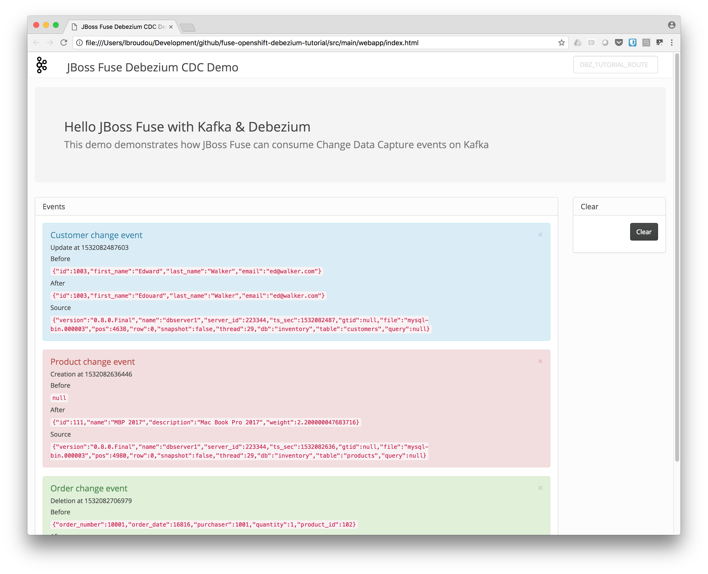

## fuse-openshift-debezium-tutorial

Completion of [Debezium tutorial](http://debezium.io/docs/openshift/) on OpenShift using a JBoss Fuse Integration Service consumer sample.

### Pre-requisites

It is assumed that you have some kind of OpenShift cluster instance running and available. This instance can take several forms depending on your environment and needs :
* Full blown OpenShift cluster at your site, see how to [Install OpenShift at your site](https://docs.openshift.com/container-platform/3.9/install_config/index.html),
* Red Hat Container Development Kit on your laptop, see how to [Get Started with CDK](http://developers.redhat.com/products/cdk/get-started/),
* Lightweight Minishift on your laptop, see [Minishift project page](https://github.com/minishift/minishift).

You should also have the `oc` client line interface tool installed on your machine. Pick the corresponding OpenShift version from [this page](https://github.com/openshift/origin/releases). Whilst I have deployed and tested everything on an OpenShift 3.9 cluster, it should also work with previous 3.7 version.

### Setup of tutorial

First, start by creating a dedicated `debezium` project for running this tutorial on your favourite OpenShift instance. You'll have to ensure to be in this project for the rest of tutorial.

```
oc new-project debezium --display-name=”Debezium” --description=”Debezium on Openshift”

```

Then we'll need to start a MySQL server instance containing some example tables. So that we can later apply some changes into database and check that Debezium Change-Data-Capture is actually working.

```
# Deploy pre-populated MySQL instance
oc new-app --name=mysql debezium/example-mysql:0.8

# Configure credentials for the database
oc env dc/mysql MYSQL_ROOT_PASSWORD=debezium  MYSQL_USER=mysqluser MYSQL_PASSWORD=mysqlpw
```

#### Setup of Kafka cluster

For this tutorial, we'll use [Strimzi](http://strimzi.io/) as the bootstrap for our Kafka cluster. Strimzi is the upstream project for the upcoming [Red Hat AMQ Streams](https://developers.redhat.com/blog/2018/05/07/announcing-amq-streams-apache-kafka-on-openshift/). Whilst Debezium documentation mention some version requirement regarding Strimzi, I changed some of them for easier switch to AMQ Streams once released.

As a cluster administrator, create all required resources and templates into the `debezium` OpenShift project.
```
export STRIMZI_VERSION=0.4.0
git clone -b $STRIMZI_VERSION https://github.com/strimzi/strimzi
cd strimzi
oc login -u system:admin
oc create -f examples/install/cluster-operator -n debezium
oc create -f examples/templates/cluster-controller -n debezium
```

Then instantiate a new Kafka broker. Depending on your resources and goal, you may want to deploy single instance/ephemeral or HA/persistent. Here's the 2 commands for the 2 options.


```
# Deploy an ephemeral single instance Kafka broker
oc new-app strimzi-ephemeral -p CLUSTER_NAME=broker -p ZOOKEEPER_NODE_COUNT=1 -p KAFKA_NODE_COUNT=1 -p KAFKA_OFFSETS_TOPIC_REPLICATION_FACTOR=1 -p KAFKA_TRANSACTION_STATE_LOG_REPLICATION_FACTOR=1

 OR

# Deploy a persistent HA instance Kafka broker
oc new-app strimzi-persistent -p CLUSTER_NAME=broker
```

This broker is using all the default parameters and will instantiate 3 Zookeeper nodes alongside 3 Kafka nodes. Each of it requires 1 GB storage so be sure you've got persistent volumes.

Wait some minutes and check pods are there at the end of deployments:

```
$ oc get pods -n debezium                                                                                                                                        
NAME                                        READY     STATUS      RESTARTS   AGE
broker-kafka-0                              1/1       Running     0          23h
broker-kafka-1                              1/1       Running     0          23h
broker-kafka-2                              1/1       Running     0          23h
broker-topic-operator-6d8c5cb9f-5nk8s       1/1       Running     0          23h
broker-zookeeper-0                          1/1       Running     0          23h
broker-zookeeper-1                          1/1       Running     0          23h
broker-zookeeper-2                          1/1       Running     0          23h
mysql-2-jpnr2                               1/1       Running     0          21h
strimzi-cluster-operator-545b447668-96dnw   1/1       Running     0          23h
```

### Setup of Debezium connector

You'll now need to deploy a Kafka Connect application that will later hold the Debezium plugins and logic for listening database changes and transform them into events published on Kafka.

Same story here, depending on your setup, here's the 2 commands:

```
# Deploy a single instance of Kafka Connect with no plug-in installed on single ephemeral Kafka
oc new-app strimzi-connect-s2i -p CLUSTER_NAME=debezium -p KAFKA_CONNECT_BOOTSTRAP_SERVERS=broker-kafka:9092 -p KAFKA_CONNECT_CONFIG_STORAGE_REPLICATION_FACTOR=1 -p KAFKA_CONNECT_OFFSET_STORAGE_REPLICATION_FACTOR=1 -p KAFKA_CONNECT_STATUS_STORAGE_REPLICATION_FACTOR=1
```

```
# Deploy a single instance of Kafka Connect with no plug-in installed on HA persistent Kafka
oc new-app strimzi-connect-s2i -p CLUSTER_NAME=debezium -p KAFKA_CONNECT_BOOTSTRAP_SERVERS=broker-kafka:9092
```

This should create a new DeploymentConfig named `debezium-connect`, as well as a `debezium` ConfigMap, a `debezium-connect` Buildonfig and 2 ImageStreams called `debezium-connect` and `debezium-connect-source`.

The next step is to add the Debezium connectors to this Kafka Connect container image. For that, we'll download them and start again the `debezium-connect` build injecting connectors libraies in it.

```
# Build a Debezium image
export DEBEZIUM_VERSION=0.8.0.Final
mkdir -p plugins && cd plugins && \
for PLUGIN in {mongodb,mysql,postgres}; do \
    curl http://central.maven.org/maven2/io/debezium/debezium-connector-$PLUGIN/$DEBEZIUM_VERSION/debezium-connector-$PLUGIN-$DEBEZIUM_VERSION-plugin.tar.gz | tar xz; \
done && \
oc start-build debezium-connect --from-dir=. --follow && \
cd .. && rm -rf plugins
```

Wait for build and subsequent deployment to finish.

Then we are going to register the Debezium MySQL connector to run against the deployed MySQL instance:

```
oc exec -i broker-kafka-0 -- curl -X POST \
    -H "Accept:application/json" \
    -H "Content-Type:application/json" \
    http://debezium-connect:8083/connectors -d @- <<'EOF'

{
    "name": "inventory-connector",
    "config": {
        "connector.class": "io.debezium.connector.mysql.MySqlConnector",
        "tasks.max": "1",
        "database.hostname": "mysql",
        "database.port": "3306",
        "database.user": "debezium",
        "database.password": "dbz",
        "database.server.id": "184054",
        "database.server.name": "dbserver1",
        "database.whitelist": "inventory",
        "database.history.kafka.bootstrap.servers": "broker-kafka:9092",
        "database.history.kafka.topic": "schema-changes.inventory"
    }
}
EOF
```

Then, you can check connector existence :

```
oc exec -i broker-kafka-0 -- curl \
    -H "Accept:application/json" \
    http://debezium-connect:8083/connectors
```

And get connector details with this latest curl command :

```
oc exec -i broker-kafka-0 -- curl \
    -H "Accept:application/json" \
    http://debezium-connect:8083/connectors/inventory-connector
```


### Building and deploying Fuse Integration Services project

The current project is a Fuse Integration Services project that just consumes Change Data Capture events emitted by Debezium from Kafka using different Camel routes. It logs events and republish them onto a WebSocket endpoints. It's up to you to add your own transformation, business or synchronisation logics within the route.

Here's the description of the 3 routes :

```
<route id="customers-cdc" streamCache="true">
    <from id="from-customers" uri="kafka:broker-kafka:9092?topic=dbserver1.inventory.customers&amp;groupId=2"/>
    <log id="log-customers" message="Customer change event: ${body}"/>
    <to id="to-ws-customers" uri="websocket://events?port=9090&amp;sendToAll=true"/>
</route>
<route id="orders-cdc" streamCache="true">
    <from id="from-orders" uri="kafka:broker-kafka:9092?topic=dbserver1.inventory.orders&amp;groupId=2"/>
    <log id="log-orders" message="Order change event: ${body}"/>
    <to id="to-ws-orders" uri="websocket://events?port=9090&amp;sendToAll=true"/>
</route>
<route id="products-cdc" streamCache="true">
    <from id="from-products" uri="kafka:broker-kafka:9092?topic=dbserver1.inventory.products&amp;groupId=2"/>
    <log id="log-products" message="Product change event: ${body}"/>
    <to id="to-ws-products" uri="websocket://events?port=9090&amp;sendToAll=true"/>
</route>
```

It is important noting here that :
* Each route is listening to a different topic created by Debezium and corresponding to changes on different tables of our database,
* We are using OpenShift/Kubernetes service discovery to be able to address the Kafka brokers using short notation (just `broker-kafka:9200` and that's it),
* Kafka connectors should use a different `groupId` of the one used by Debezium (here we're using `2`).

You have to build it using Maven Fabric8 plugin.


If you're using CDK or Minishift locally, you may want to setup your Docker environment variables to reuse the remote Docker daemon. Using CDK or Minishift, it just ends up like this :

```
$ eval $(minishift docker-env)
$ oc project debezium
```

And then run Maven command to build and deploy everything :

```
$ mvn fabric8:deploy
```

This creates a new `dbz-tutorial` deployment config and associated pod with a Fuse container.
After some minutes the deployment should and you'll have to retrieve the exposed route for testing:

```
oc get routes                                                                                                                   
NAME           HOST/PORT                                              PATH      SERVICES       PORT      TERMINATION   WILDCARD
dbz-tutorial   dbz-tutorial-debezium.apps.example.com                 dbz-tutorial   <all>                   None
```


### Testing everything

In order to test if everything is fine and running as expected, here is a simple test procedure :
* open a terminal within the `mysql` container,
* follow logs on the `dbz-tutorial` container,
* open this [single page](src/main/webapp/index.html) into a browser and ensure to setup the `dbz-tutorial` route on the top-right input box (click outside to change value).

In the `mysql` terminal, log to mysql console using `mysqluser` and `mysqlpw` on `inventory` database. Make some simple changes on the different `inventory` table.s

```
mysql -u mysqluser -pmysqlpw inventory

mysql> UPDATE customers SET first_name='Edouard' WHERE id=1003;                                

mysql> INSERT INTO products VALUES (111, 'MBP 2017', 'Mac Book Pro 2017', 2.2);

mysql> DELETE FROM orders WHERE order_number=10001;
```

Check the `dbz-tutorial` logs that immediately prints the new event found by the Camel route using the Kafka connector :

```
10:28:07.982 [Camel (camel) thread #0 - KafkaConsumer[dbserver1.inventory.customers]] INFO  customers-cdc - Customer change event: {"schema":{"type":"struct","fields":[{"type":"struct","fields":[{"type":"int32","optional":false,"field":"id"},{"type":"string","optional":false,"field":"first_name"},{"type":"string","optional":false,"field":"last_name"},{"type":"string","optional":false,"field":"email"}],"optional":true,"name":"dbserver1.inventory.customers.Value","field":"before"},{"type":"struct","fields":[{"type":"int32","optional":false,"field":"id"},{"type":"string","optional":false,"field":"first_name"},{"type":"string","optional":false,"field":"last_name"},{"type":"string","optional":false,"field":"email"}],"optional":true,"name":"dbserver1.inventory.customers.Value","field":"after"},{"type":"struct","fields":[{"type":"string","optional":true,"field":"version"},{"type":"string","optional":false,"field":"name"},{"type":"int64","optional":false,"field":"server_id"},{"type":"int64","optional":false,"field":"ts_sec"},{"type":"string","optional":true,"field":"gtid"},{"type":"string","optional":false,"field":"file"},{"type":"int64","optional":false,"field":"pos"},{"type":"int32","optional":false,"field":"row"},{"type":"boolean","optional":true,"default":false,"field":"snapshot"},{"type":"int64","optional":true,"field":"thread"},{"type":"string","optional":true,"field":"db"},{"type":"string","optional":true,"field":"table"},{"type":"string","optional":true,"field":"query"}],"optional":false,"name":"io.debezium.connector.mysql.Source","field":"source"},{"type":"string","optional":false,"field":"op"},{"type":"int64","optional":true,"field":"ts_ms"}],"optional":false,"name":"dbserver1.inventory.customers.Envelope"},"payload":{"before":{"id":1003,"first_name":"Edward","last_name":"Walker","email":"ed@walker.com"},"after":{"id":1003,"first_name":"Edouard","last_name":"Walker","email":"ed@walker.com"},"source":{"version":"0.8.0.Final","name":"dbserver1","server_id":223344,"ts_sec":1532082487,"gtid":null,"file":"mysql-bin.
000003","pos":4638,"row":0,"snapshot":false,"thread":29,"db":"inventory","table":"customers","query":null},"op":"u","ts_ms":1532082487603}}
[...]
```

Also check the GUI and you should see some event blocks appear. Events have different colors depending on the table/topic that has changed. It detects if its an update, a creation or a deletion and highlight the different usefull values into a Debezium event.


